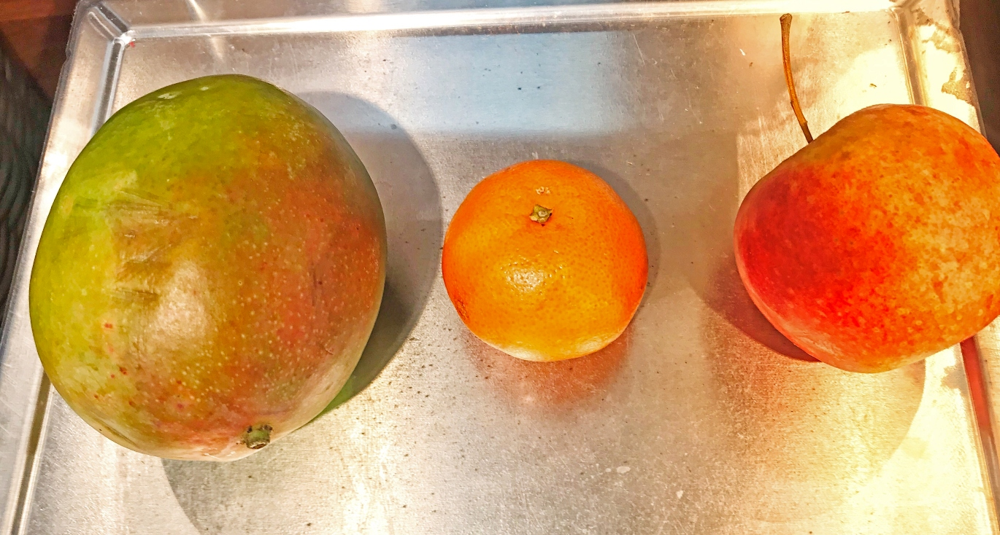

# Predict-the-fruit


[](https://opensource.org/licenses/MIT) 

This is a machine learning model using [Decision tree](https://en.wikipedia.org/wiki/Decision_tree_model) algorithm to predict the fruits. The user has to input the weight of the fruit and the texture of the fruit if the fruit is smooth user have to put 1 otherwise 0.



## How to start

Just run the following file:

```bash
python3 fruits_classifier.py
```
Now insert all the requires details to see the prediction.

## Built With
* [Python 3.7](https://www.python.org/downloads/).

## Author

* **Md Shariful Alam** - [Shariful](https://github.com/Shourov1)
